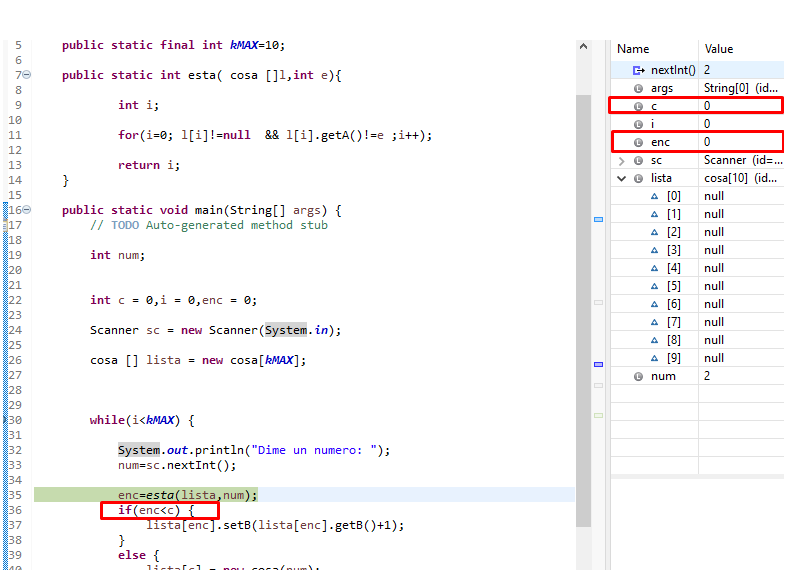
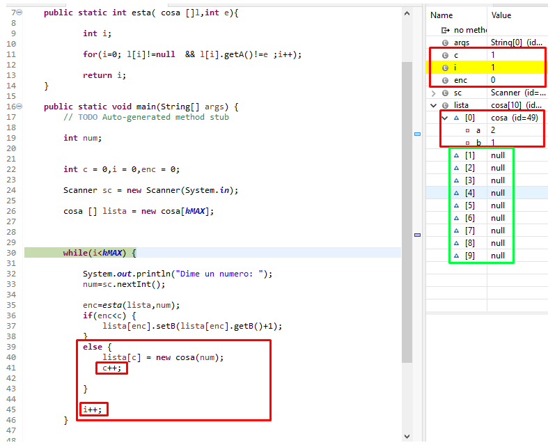
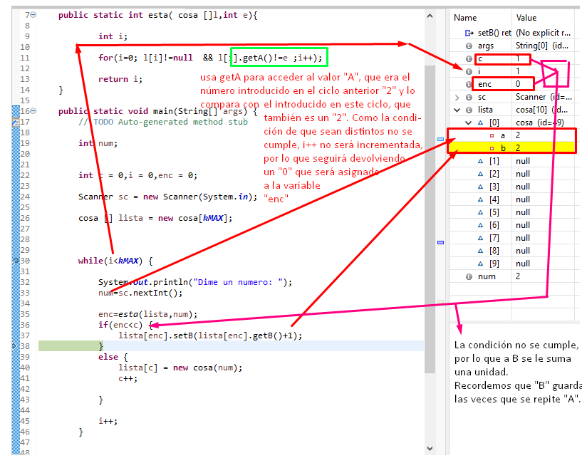
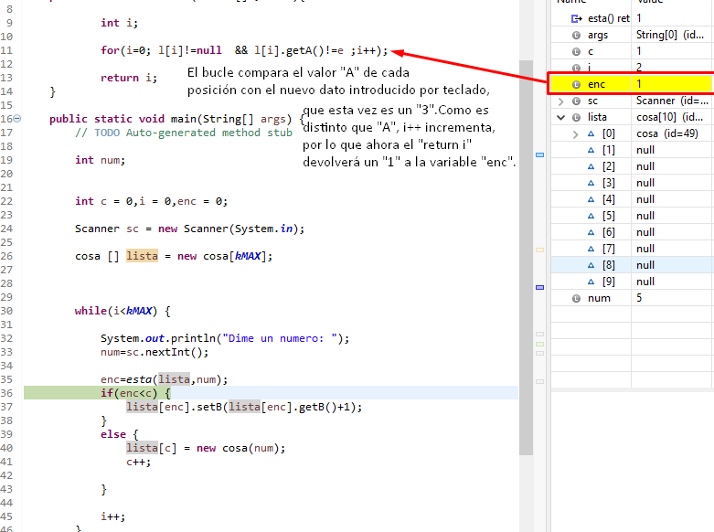
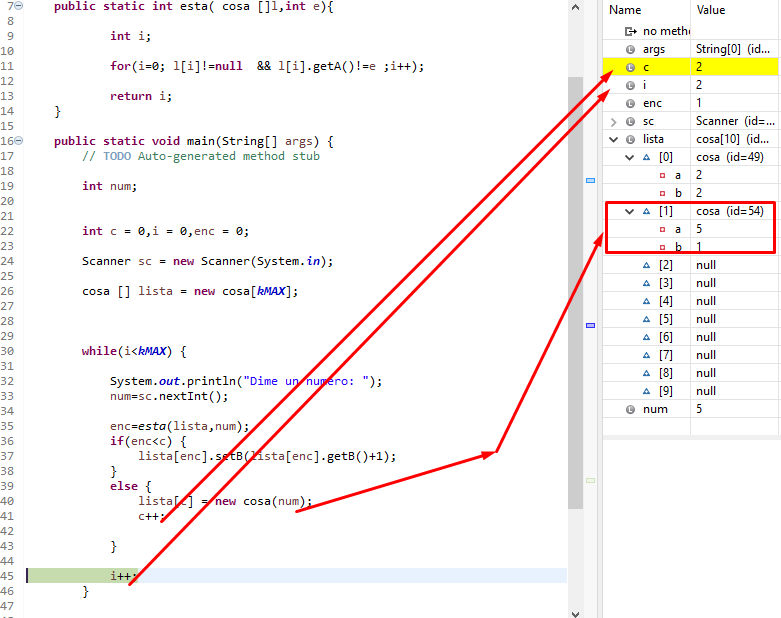

# TAREA 6 - DEPURACIÓN 3

#### 1- EXPLICA QUÉ HACE EL MÉTODO MAIN

Para entender el código, primero tenemos que hacer referencia a las variables creadas en el main anteriormente, las cuales son:

Num -> será el número que introducimos por teclado.

C --> aumenta cada vez que se introduce un número que no esté repetido.

I --> va incrementando al finalizar las condiciones "if y else",hasta que su valor sea una unidad inferior al tamaño del array, el cual está definido por una constante final llamada KMAX, que tiene un valor de 10.

Enc --> aumenta en uno cada vez que se introduce un número que no esté repetido.

A: Almacena los números introducidos por teclado que no se repiten.

B: Almacena los números introducidos por teclado que sí se repiten.

Array cosa, en el cual se almacena el número pedido por teclado, la posición y la veces que se repite dicho número.

Para finalizar, encima del main hay una funcion llamada "esta", a la cual se le pasan los datos del número introducido por teclado y la posición de la lista, para que compruebe si el número es repetido o no y si la lista tiene un valor ya asignado o aún no tiene ninguno(null).

# EXPLICACIÓN DEL MÉTODO

Línea 26: 

Se crea un array "cosa" con un tamaño de 10 posicione.

Línea 27:
Se crea una condición "while", que se ejecutará siempre y cuando el valor de "i" sea inferior que el tamaño del array,"KMAX.", que es de 10 posiciones.

Línea 29 y 30, pedir e introducir un valor numérico por teclado.

Línea 32:

Hay una variable que llama a la función definida en la línea 7, la cual comprueba que la posición de la lista está vacía y que el número introducido no está repetido(haciendo uso de la variable "A", que guarda cada número nuevo que no se repite.)

Línea 33:

Se crea una condición if, que compara la variable "enc" (que de momento vale 0), con la variable "c" (que es un contador de las listas creadas, que actualmente tiene un valor de 0).

Como la condición no se cumple, salta a el "else" de la línea 36, y, a continuación, crea una nueva lista en la posición "0" del array,en la variable "c", asignándole el valor que habíamos introducido por teclado con la variable "num".
Después de esto,la posición de la variable "c = 0" pasa a valer 1, ya que en la línea 38 se incrementa en una unidad.

Por último, se incrementa el valor de "I"en uno y volvemos de nuevo a la línea 27, la cual comprobaba que si el valor de "I" es menor que el tamaño del array, pasaría a la siguiente fase.

Supongamos que ahora volvemos a introducir el mismo número que hemos introducido anteriormente.

La función que es llamada en la línea 32 hará uso del "getA", y comprobará si el nuevo dato introducido por teclado coincide con uno ya almacenado. Como en este caso el número ya existe, el valor de la "I" en esa función no incrementa, por lo que el el "return i" devolverá el mismo valor que en el número introducido anteriormente, por lo cual la variable "enc" de la línea 32 seguirá valiendo lo mismo.

Ahora, se compara ese valor con el contador "c" de las nuevas listas creadas(recordemos que anteriormente su valor se ha incrementado con el código "c++;") y, como no se cumple, se llama a setB para sumarle una unidad, ya que B guarda el número de veces que se repite un número introducido por teclado y, por último, se vuelve a incrementar "I" en una unidad, hasta que no sea menor que "KMAX".

Supongamos que ahora introducimos un número nuevo.

La función comprobará si ese número está repetido o no,y también si la posición de la lista está vaciá o ya hay un número asignado y, en caso de no estarlo, incrementará en una unidad el valor "i" de esa función, aumentando entonces el valor de la variable "enc" en "1", ya que el "return i" devovlerá ese "1".

Ahora se compara el valor de "enc = 1" con el valor "c = 1". Como "1 < 1" no se cumple,saltará al "else", asignándole el valor "num = 5" en la posición 1 del array usando la variable "c".

Se incrementa "c" ---> c++;  que ahora valdrá "2".

También se incrementa "i" -- i++;  hasta que cumpla la funcón de no ser menor que "KMAX".

# 3. ¿QUÉ HACE "A" Y "B" ?

La variable "A" almacena los valores introducidos por teclado, siempre que éstos sean números nuevos que no hayan sido introducidos anteriormente.

La variable "B" almacena las veces que se repite el número "A".

Ejemplo 1:

Números: 1, 2, 3, 4, 5 

A = 1,2,3,4,5

B-->1 = 1

B-->2 = 1

B-->3 = 1

B-->4 = 1

B-->5 = 1

Ejemplo 2:

Números: 1, 4, 4, 4, 4, 4, 6, 6, 6, 7 

A = 1,4,6,7

B-->1 = 1

B-->4 = 5

B-->6 = 3

B-->7 = 1

